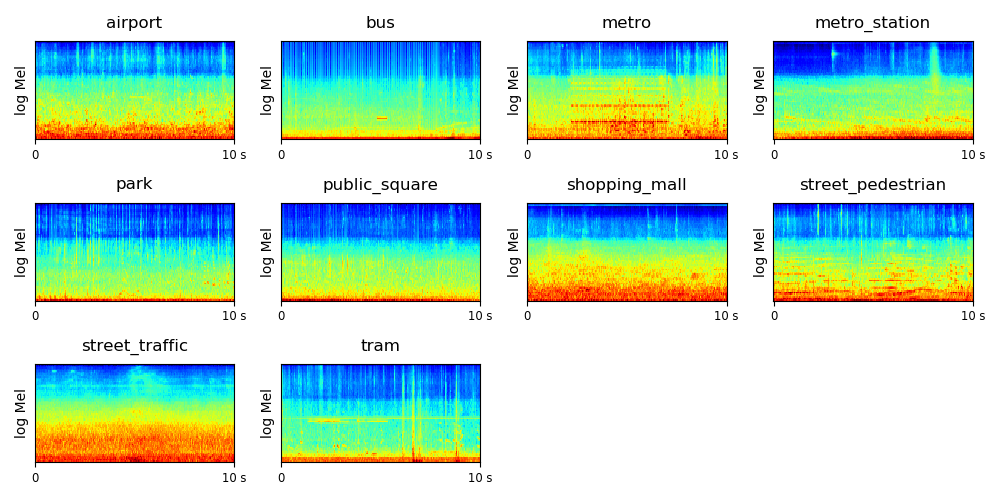

# DCASE 2018 Task 1 Acoustic Scene Classification

DCASE 2018 Task 1 acoustic scene classification is a challenge to classifiy a 10 second audio clip to one of 10 classes such as 'airport', 'urban park', etc. We provide a convolutional neural network (CNN) baseline system implemented with PyTorch in this code base. More details about this challenge can be found http://dcase.community/challenge2018/task-acoustic-scene-classification

## DATASET

The dataset is downloadable from http://dcase.community/challenge2018/task-acoustic-scene-classification

The dataset contains 10 classes of audio scenes, recorded with Device A, B and C. The statistic of the data is shown below:

|           |         Attributes        |                    Dev.                    | Test |
|:---------:|:-------------------------:|:------------------------------------------:|:----:|
| Subtask A | Binanural, 48 kHz, 24 bit |               Device A: 8640               | 1200 |
| Subtask B |       Mono, 44.1 kHz      | Device A: 8640 Device B: 720 Device C: 720 | 2400 |
| Subtask C |             -             |                  Any data                  | 1200 |

The log mel spectrogram of the scenes are shown below:

## Run the code

(Optional) Install dependent packages. If you are using conda, simply run:

$ conda env create -f environment.yml

$ conda activate py3_dcase2018_task1

Then simply run:

**$ ./runme.sh**

Or run the commands in runme.sh line by line, including: 

(1) Modify the paths of data and your workspace

(2) Extract features

(3) Train model

(4) Evaluation

## Result

We apply a convolutional neural network on the log mel spectrogram feature to solve this task. Training takes around 100 ms / iteration on a GTX Titan X GPU. The model is trained for 3000 iterations. The result is shown below. 

### Subtask A

Averaged accuracy over 10 classes:

|                   | Device A |
|:-----------------:|:--------:|
| averaged accuracy |   68.2%  |

Confusion matrix:

### Subtask B

Averaged accuracy over 10 classes of device A, B and C:

|                   | Device A | Device B | Device C |
|:-----------------:|:--------:|----------|----------|
| averaged accuracy |   67.4%  | 59.4%    | 57.2%    |

Confusion matrix:

## Summary
This codebase provides a convolutional neural network (CNN) for DCASE 2018 challenge Task 1. 

### External link

The official baseline system implemented using Keras can be found https://github.com/DCASE-REPO/dcase2018_baseline
